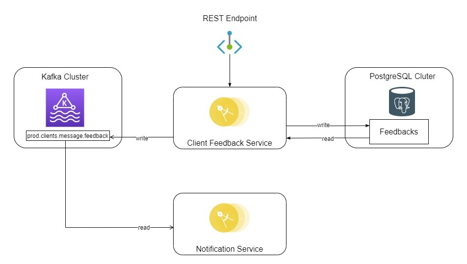

# Client Feedback Service
## Description
This service is responsible for creating and store clients feedbac.

## Technical details

- [Source code](https://github.com/maximmchub/springbootcourse/) in GitHub.
- Jenkins [CI pipeline](https://jenkins.devops.aval:8443/job/BASS/job/svc_333/).
- [SonarQube project](http://sonar.devops.aval:9003/dashboard?id=bass_471) with static code analysis results.
- Service [configuration parameters](https://github.com/maximmchub/springbootcourse/blob/master/src/main/resources/application.yaml).
- Configuration for [DEV](), [UAT](), and [PROD]() environments.

## Architectural diagram

## Sequence diagram

## Service API

Service exposes [REST API](/api/openapi.json) for creating and processing client requests.

Some REST API endpoints are protected with JWT based authorization (personal or service to service).

## Data storages

#### PostgreSQL DB

**feedbacks** - main DB schema to store client feedbacks.

#### Kafka topics

| Topic name | Cluster | Permissions | Description |
| ---------- | ------- | ----------- | ----------- |
| **prod.clients.message.feedback** | INTERNAL | WRITE | Ticket created request processing events |

## Integrations

## Implementation details

